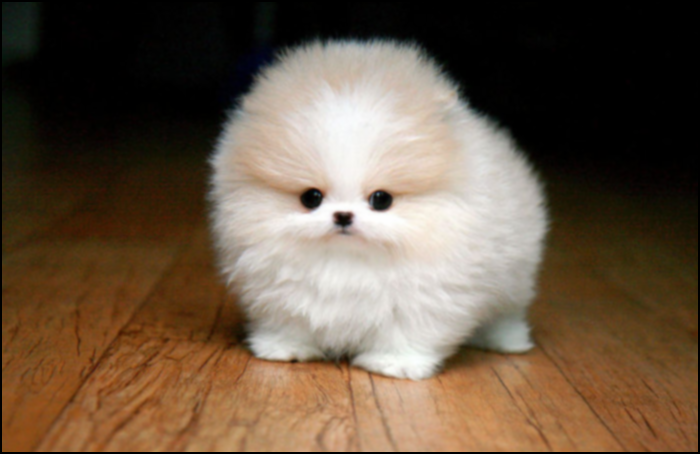
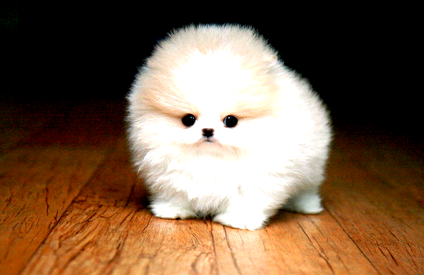

# CUDA Image Processing Project: Brightness, Grayscale, and Blur

A high-performance CUDA-based application for real-time image processing, supporting operations like adjusting brightness, converting images to grayscale, and applying a blur effect. This project leverages GPU acceleration for fast and efficient image manipulation.

<p align="center"> 
  
   
</p>

## Features

- **Brightness Adjustment**: Modify image brightness with real-time performance.
- **Grayscale Conversion**: Convert images to grayscale for simpler representation.
- **Blur Effect**: Apply a blur filter to smooth images and reduce noise.
- **GPU Acceleration**: Leverages NVIDIA CUDA for parallel processing and speed optimization.

## Getting Started

### Prerequisites

- NVIDIA GPU with CUDA support
- CUDA Toolkit installed (v11.0 or later)
- C++ compiler

### Installation

#### Clone the Repository

```bash
git clone https://github.com/your-username/cuda-image-processing.git
cd cuda-image-processing
```


## How to Use
**Brightness Adjustment**
Command-line option: `--brightness [value]`

Example:
`./image_processor input.jpg output.jpg --brightness 50`

**Grayscale Conversion**
Command-line option: `--grayscale`

Example:
`./image_processor input.jpg output.jpg --grayscale`

**Apply Blur Effect**
Command-line option: `--blur [kernel_size]`

Example:
`./image_processor input.jpg output.jpg --blur 5`


## Tech Stack
**Languages**: C++ with CUDA extensions
**Framework**: NVIDIA CUDA Toolkit
**Tools**: OpenCV (for image handling)


## Contributing
**Contributions are welcome! Follow these steps to contribute**:
1) Fork the repository.
2) Create a new branch for your feature or bug fix.
3) Commit your changes with descriptive messages.
4) Submit a pull request.

## License
This project is licensed under the MIT License. See the LICENSE file for details.
